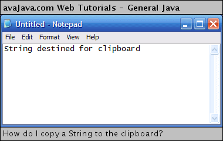

# How do I copy a String to the clipboard?

## Description: This Java example shows how to copy a String to the clipboard.

The `CopyStringToClipboard` class demonstrates how to take a String and copy it to the System Clipboard. It gets the System Clipboard from the default Toolkit. It then creates a String Selection from our String and sets the contents of the Clipboard with the String Selection.

### [CopyStringToClipboard.java](CopyStringToClipboard.java)

```java
package test;

import java.awt.Toolkit;
import java.awt.datatransfer.Clipboard;
import java.awt.datatransfer.StringSelection;

public class CopyStringToClipboard {

	public static void main(String[] args) {

		String str = "String destined for clipboard";

		Toolkit toolkit = Toolkit.getDefaultToolkit();
		Clipboard clipboard = toolkit.getSystemClipboard();
		StringSelection strSel = new StringSelection(str);
		clipboard.setContents(strSel, null);

	}

}
```

If we execute `CopyStringToClipboard` and open Notepad and go to Paste, we can see that our `String` indeed has been copied to the System Clipboard.

