## Unit Testing with JUnit - Tutorial

Version 2.8

08.06.2015

**JUnit**

This tutorial explains unit testing with JUnit 4.x. It explains the creation of JUnit tests. It also covers the usage of the Eclipse IDE to work with JUnit tests.

**Table of Contents**

* [1. Unit tests, integration tests and performance tests](#1-unit-tests-integration-tests-and-performance-tests)
    * [1.1. Unit tests and unit testing](#11-unit-tests-and-unit-testing)
    * [1.2. Integration tests](#12-integration-tests)
    * [1.3. Performance tests](#13-performance-tests)
    * [1.4. Building effective tests](#14-building-effective-tests)
* [2. Testing terminology](#2-testing-terminology)
    * [2.1. Test fixture](#21-test-fixture)
    * [2.2. Behavior vs. state testing](#22-behavior-vs-state-testing)
* [3. Test organization](#3-test-organization)
    * [3.1. Test organization for Java projects](#31-test-organization-for-java-projects)
    * [3.2. What should you test?](#32-what-should-you-test)
    * [3.3. Introducing tests in legacy code](#33-introducing-tests-in-legacy-code)
* [4. Testing frameworks for Java](#unittesting)
* [5. Using JUnit](#junittesting)
    * [5.1. The JUnit framework](#unittesting_junit)
    * [5.2. How to define a test in JUnit?](#unittesting_junit_test)
    * [5.3. Example JUnit test](#unittesting_junitexample)
    * [5.4. JUnit naming conventions](#junit_namingconventions)
    * [5.5. JUnit naming conventions for Maven](#junit_namingconventions_maven)
    * [5.6. JUnit test suites](#juniteclipse_testsuite)
    * [5.7. Run your test from the command line](#juniteclipse_code)
* [6. Basic JUnit code constructs](#junitannoationsandassertstatements)
    * [6.1. Available JUnit annotations](#usingjunit_annotations)
    * [6.2. Assert statements](#usingjunit_asserts)
    * [6.3. Test execution order](#usingjunit_executionorder)
* [7. Installation of JUnit](#installation)
    * [7.1. Using JUnit with Gradle](#installation_gradle")
    * [7.2. Using JUnit integrated into Eclipse](#installation_eclipse)
    * [7.3. Downloading the JUnit library](#installation_junit)
* [8. Eclipse support for JUnit](#eclipse)
    * [8.1. Creating JUnit tests](#eclipse_creatingjunittest)
    * [8.2. Running JUnit tests](#eclipse_runningjunittest)
    * [8.3. JUnit static imports](#usingjunit_staticimports)
    * [8.4. Wizard for creating test suites](#usingjunit_testsuites)
    * [8.5. Testing exception](#usingjunit_execption)
    * [8.6. JUnit Plug-in Test](#usingjunit_plugintest)
* [9. Setting Eclipse up for using JUnits static imports](#juniteclipse_staticimports)
* [10. Exercise: Using JUnit](#juniteclipse)
    * [10.1. Project preparation](#juniteclipse_prep)
    * [10.2. Create a Java class](#juniteclipse_class)
    * [10.3. Create a JUnit test](#juniteclipse_test)
    * [10.4. Run your test in Eclipse](#juniteclipse_eclipse)
* [11. Advanced JUnit options](#junitadvanced)
    * [11.1. Parameterized test](#junitadvanced_parameterizedtests)
    * [11.2. JUnit Rules](#junitadvanced_rules)
    * [11.3. Writing custom JUnit Rules](#junitadvanced_rules_writingcustomrules)
    * [11.4. Categories](#junitadvanced_categories)
* [12. Mocking](#mockingframeworks)
* [13. Links and Literature](#resources)
    * [13.1. Source Code](#sourcecode)
    * [13.2. JUnit Resources](#junit_links)


## 1. Unit tests, integration tests and performance tests

### 1.1. Unit tests and unit testing

A *unit test* is a piece of code written by a developer that executes a specific functionality in the code to be tested and asserts a certain behavior or state.

The percentage of code which is tested by unit tests is typically called *test coverage*.

A unit test targets a small unit of code, e.g., a method or a class, (local tests). External dependencies should be removed for unit tests, e.g., by replacing the dependency with a test implementation or a (mock) object created by a test framework.

Unit tests are not suitable for testing complex user interface or component inteaction. For this you should develop integration tests.

### 1.2. Integration tests

An *integration test* has the target to test the behavior of a component or the integration between a set of components. The term *functional test* is sometimes used as synonym for integration test.

This kind of tests allow you to translate your user stories into a test suite, i.e., the test would resemble an expected user interaction with the application.

### 1.3. Performance tests

Performance tests are used to benchmark software components repeatedly.

### 1.4. Building effective tests

Software unit tests allow you to easily verify that the logic of individual units is correct.

Running unit tests after every build or code change help to identify software regressions introduced by these new changes. Having a high test coverage of your code allows you to continue developing features without having to perform lots of manual tests.

Integration tests check that the whole system works as intended, also reducing the need for intensive manual tests and performance tests allow to ensure that the whole application also works under high load.


## 2. Testing terminology

### 2.1. Test fixture

The *test fixture* is a fixed state of the software under test used as a baseline for running tests.

### 2.2. Behavior vs. state testing

A test is a behavior test (also called interaction test) if it does not validate the result of a method call, but checks if certain methods were called with the correct input parameters.

State testing is about validating the result, while behavior testing is about testing the behavior of the application under test.

If you are testing algorithms or system functionality, you want to test in most cases state and not interactions. A typical test setup uses mocks or stubs of related classes to abstract the interactions with these other classes away and tests state in the object which is tested.


## 3. Test organization

### 3.1. Test organization for Java projects

Typical unit tests are created in a separate project or separate source folder to keep the test code separate from the real code.

### 3.2. What should you test?

What should be tested is a hot topic for discussion. Some developers believe every statement in your code should be tested.

In general it is safe to ignore trivial code as, for example, getter and setter methods which simply assign values to fields. Writing tests for these statements is time consuming and pointless, as you would be testing the Java virtual machine. The JVM itself already has test cases for this and you are safe to assume that field assignment works in Java if you are developing end user applications.

You should write software tests in any case for the critical and complex parts of your application. A solid test suite also protects you against regression in existing code if you introduce new features.

### 3.3. Introducing tests in legacy code

If you start developing tests for an existing code base without any tests, it is good practice to start writing tests for the parts of the application in which most errors happened in the past. This way you can focus on the critical parts of your application.


## 4. Testing frameworks for Java

Where are several testing frameworks available for Java. The most popular ones are [JUnit](http://junit.org/) and [TestNG](http://testng.org/).

This description focuses at JUnit.


## 5. Using JUnit

### 5.1. The JUnit framework

*JUnit* in version 4.x is a test framework which uses annotations to identify methods that specify a test.

The main websites for JUnit are the [JUnit homepage](http://junit.org/) and the [GitHub project page](https://github.com/junit-team/junit).

### 5.2. How to define a test in JUnit?

A JUnit *test* is a method contained in a class which is only used for testing. This is called a *Test class*.

To write a test with the JUnit 4.x framework you annotate a method with the `@org.junit.Test` annotation.

In this method you use an *assert* method, typically provided by the JUnit or another assert framework, to check the expected result of the code execution versus the actual result. These method calls are typically called *asserts* or *assert statements*.

You should provide meaningful messages in assert statements so that it is easier for the developer to identify the problem. This helps in fixing the issue, especially if someone looks at the problem, who did not write the code under test or the test code.

### 5.3. Example JUnit test

The following code shows a JUnit test. This test assumes that the `MyClass` class exists and has a `multiply(int, init)` method.

```java
package org.eclipse.e4.core.internal.tests;

import static org.junit.Assert.assertEquals;

import org.junit.Test;

public class MyTests {

    @Test
    public void multiplicationOfZeroIntegersShouldReturnZero() {

        // MyClass is tested
        MyClass tester = new MyClass();

        // assert statements
        assertEquals("10 x 0 must be 0", 0, tester.multiply(10, 0));
        assertEquals("0 x 10 must be 0", 0, tester.multiply(0, 10));
        assertEquals("0 x 0 must be 0", 0, tester.multiply(0, 0));
    }

}
```

### 5.4. JUnit naming conventions

There are several potential naming conventions for JUnit tests. In widespread use is to use the name of the class under test and to add the "Test" suffix to the test class.

For the test method names it is frequently recommended to use the word "should" in the test method name, as for example "ordersShouldBeCreated" or "menuShouldGetActive" as this gives a good hint what should happen if the test method is executed.

As a general rule, a test name should explain what the test does so that it can be avoided to read the actual implementation.

### 5.5. JUnit naming conventions for Maven

If you are using the Maven build system, you should prefer the "Test" suffix over "Tests" as the Maven build system (via its surfire plug-in) automatically includes such classes in its test scope.

### 5.6. JUnit test suites

If you have several test classes, you can combine them into a *test suite*. Running a test suite will execute all test classes in that suite in the specified order.

The following example code shows a test suite which defines that two test classes (MyClassTest and MySecondClassTest) should be executed. If you want to add another test class you can add it to `@Suite.SuiteClasses` statement.

```java
package com.vogella.junit.first;

import org.junit.runner.RunWith;
import org.junit.runners.Suite;
import org.junit.runners.Suite.SuiteClasses;

@RunWith(Suite.class)
@SuiteClasses({ MyClassTest.class, MySecondClassTest.class })
public class AllTests {

}
```

A test suite can also contain other test suites.

### 5.7. Run your test from the command line

You can also run your JUnit tests outside Eclipse via standard Java code. Build frameworks like Apache Maven or Gradle in combination with a Continuous Integration Server (like Hudson or Jenkins) are typically used to execute tests automatically on a regular basis.

The `org.junit.runner.JUnitCore` class provides the `runClasses()` method which allows you to run one or several tests classes. As a return parameter you receive an object of the type `org.junit.runner.Result`. This object can be used to retrieve information about the tests.

The following class demonstrates how to run the MyClassTest. This class will execute your test class and write potential failures to the console.

```java
package de.vogella.junit.first;

import org.junit.runner.JUnitCore;
import org.junit.runner.Result;
import org.junit.runner.notification.Failure;

public class MyTestRunner {
    public static void main(String[] args) {
        Result result = JUnitCore.runClasses(MyClassTest.class);
        for (Failure failure : result.getFailures()) {
            System.out.println(failure.toString());
        }
    }
}
```

This class can be executed like any other Java program on the command line. You only need to add the JUnit library JAR file to the classpath.


## 6. Basic JUnit code constructs

### 6.1. Available JUnit annotations

JUnit 4.x uses annotations to mark methods as test methods and to configure them. The following table gives an overview of the most important annotations in JUnit.

**Table 1. Annotations**

Annotation | Description
-----------|------------
@Test<br> public void method() | The `@Test` annotation identifies a method as a test method.
@Test (expected = Exception.class) | Fails if the method does not throw the named exception.
`@Test(timeout=100)` | Fails if the method takes longer than 100 milliseconds.
@Before<br> public void method() | This method is executed before each test. It is used to prepare the test environment (e.g., read input data, initialize the class).
@After<br> public void method() | This method is executed after each test. It is used to cleanup the test environment (e.g., delete temporary data, restore defaults). It can also save memory by cleaning up expensive memory structures.
@BeforeClass<br> public static void method() | This method is executed once, before the start of all tests. It is used to perform time intensive activities, for example, to connect to a database. Methods marked with this annotation need to be defined as `static` to work with JUnit.
@AfterClass<br> public static void method() | This method is executed once, after all tests have been finished. It is used to perform clean-up activities, for example, to disconnect from a database. Methods annotated with this annotation need to be defined as `static` to work with JUnit.
`@Ignore` or `@Ignore("Why disabled")` | Ignores the test method. This is useful when the underlying code has been changed and the test case has not yet been adapted. Or if the execution time of this test is too long to be included. It is best practice to provide the optional description, why the test is disabled.

### 6.2. Assert statements

JUnit provides static methods in the `Assert` class to test for certain conditions. These *assert statements* typically start with `assert` and allow you to specify the error message, the expected and the actual result. An *assertion method* compares the actual value returned by a test to the expected value, and throws an `AssertionException` if the comparison test fails.

The following table gives an overview of these methods. Parameters in [] brackets are optional and of type String.

**Table 2. Methods to assert test results**

Statement | Description
----------|------------
`fail(message)` | Let the method fail. Might be used to check that a certain part of the code is not reached or to have a failing test before the test code is implemented. The message parameter is optional.
`assertTrue([message,] boolean condition)` | Checks that the boolean condition is true.
`assertFalse([message,] boolean condition)` | Checks that the boolean condition is false.
`assertEquals([message,] expected, actual)` | Tests that two values are the same. Note: for arrays the reference is checked not the content of the arrays.
`assertEquals([message,] expected, actual, tolerance)` | Test that float or double values match. The tolerance is the number of decimals which must be the same.
`assertNull([message,] object)` | Checks that the object is null.
`assertNotNull([message,] object)` | Checks that the object is not null.
`assertSame([message,] expected, actual)` | Checks that both variables refer to the same object.
`assertNotSame([message,] expected, actual)` | Checks that both variables refer to different objects.

### 6.3. Test execution order

JUnit assumes that all test methods can be executed in an arbitrary order. Well-written test code should not assume any order, i.e., tests should not depend on other tests.

As of JUnit 4.11 the defaulwhich may vary from run to run.t is to use a deterministic, but not predictable, order for the execution of the tests

You can use an annotation to define that the test methods are sorted by method name, in lexicographic order. To activate this feature, annotate your test class with the `@FixMethodOrder(MethodSorters.NAME_ASCENDING)` annotation. You can also explicitely set the default by using the `MethodSorters.DEFAULT` parameter in this annotation. You can also use `MethodSorters.JVM` which uses the JVM defaults, which may vary from run to run.


## 7. Installation of JUnit

### 7.1. Using JUnit with Gradle

To use JUnit in your Gradle build, simply add a testCompile dependency to it.

```
apply plugin: 'java'

dependencies {
    testCompile 'junit:junit:4.12'
}
```

### 7.2. Using JUnit integrated into Eclipse

The Eclipse IDE ships with a version of JUnit. If you use Eclipse, no additional download is required.

### 7.3. Downloading the JUnit library

If you want to control the used JUnit library explicitly, download JUnit4.x.jar from the following JUnit website. The download contains the `junit-4.*.jar` which is the JUnit library. Add this library to your Java project and add it to the classpath.

```
http://junit.org/
```


## 8. Eclipse support for JUnit

### 8.1. Creating JUnit tests

You can write the JUnit tests manually, but Eclipse supports the creation of JUnit tests via wizards.

For example, to create a JUnit test or a test class for an existing class, right-click on your new class, select this class in the *Package Explorer* view, right-click on it and select *New* &#8594; *JUnit Test Case*.

Alternatively you can also use the JUnit wizards available under *File* &#8594; *New* &#8594; *Other...* &#8594; *Java* &#8594; *JUnit*.

### 8.2. Running JUnit tests

The Eclipse IDE also provides support for executing your tests interactively.

To run a test, select the class which contains the tests, right-click on it and select <span class="guimenu">Run-as &#8594; <span class="guisubmenu">JUnit Test. This starts JUnit and executes all test methods in this class.

Eclipse provides the **Alt**+**Shift**+**X,** **,T** shortcut to run the test in the selected class. If you position the cursor in the Java editor on one test method name, this shortcut runs only the selected test method.

To see the result of an JUnit test, Eclipse uses the *JUnit* view which shows the results of the tests. You can also select individual unit tests in this view, right-click on them and select *Run* to execute them again.

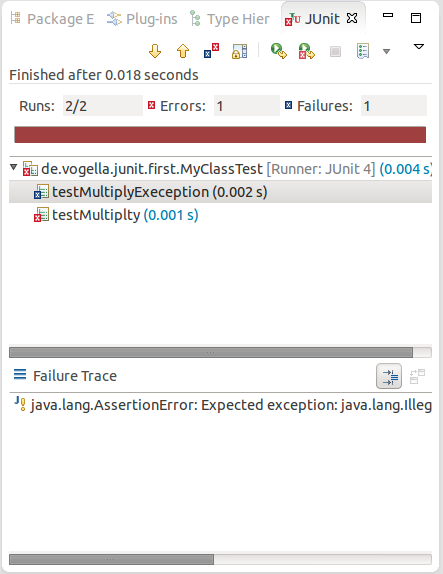

By default this view shows all tests. You can also configure, that it only shows failing tests.

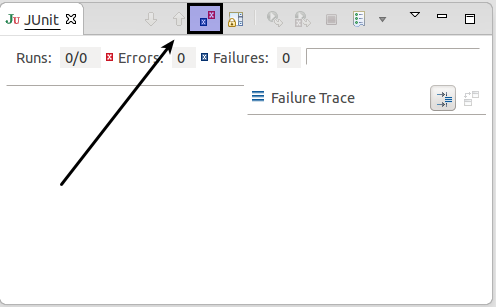

You can also define that the view is only activated if you have a failing test.

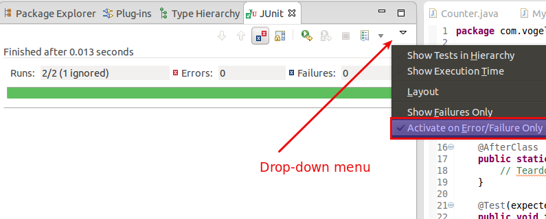

> **Note:** Eclipse creates run configurations for tests. You can see and modify these via the *Run* &#8594; *Run Configurations...* menu.

### 8.3. JUnit static imports

Static import is a feature that allows fields and methods) defined in a class as `public static` to be used in Java code without specifying the class in which the field is defined.

JUnit assert statement are typically defined as `public static` to allow the developer to write short test statements. The following snippet demonstrates an assert statement with and without static imports.

```java
// without static imports you have to write the following statement
Assert.assertEquals("10 x 5 must be 50", 50, tester.multiply(10, 5));


// alternatively define assertEquals as static import
import static org.junit.Assert.assertEquals;

// more code

// use assertEquals directly because of the static import
assertEquals("10 x 5 must be 50", 50, tester.multiply(10, 5));
```

### 8.4. Wizard for creating test suites

To create a test suite in Eclipse, you select the test classes which should be included into this in the *Package Explorer* view, right-click on them and select *New* &#8594; *Other...* &#8594; *JUnit* &#8594; *JUnit Test Suite*.

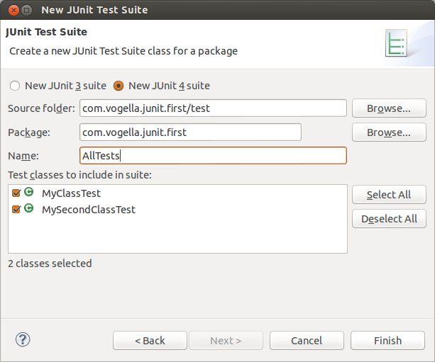

### 8.5. Testing exception

The `@Test (expected = Exception.class)` annotation is limited as it can only test for one exception. To test exceptions, you can use the following test pattern.

```java
try {
    mustThrowException();
    fail();
} catch (Exception e) {
    // expected
    // could also check for message of exception, etc.
}
```

### 8.6. JUnit Plug-in Test

JUnit Plug-in tests are used to write unit tests for your plug-ins. These tests are executed by a special test runner that launches another Eclipse instance in a separate VM—just and executes the test methods within that instance.


## 9. Setting Eclipse up for using JUnits static imports

The Eclipse IDE cannot always create the corresponding `static import` statements automatically.

You can configure the Eclipse IDE to use code completion to insert typical JUnit method calls and to add the static import automatically. For this open the Preferences via *Window* &#8594; *Preferences* and select *Java* &#8594; *Editor* &#8594; *Content Assist* &#8594; *Favorites*.

Use the *New Type* button to add the following entries to it:

* `org.junit.Assert`
* `org.hamcrest.CoreMatchers`
* `org.hamcrest.Matchers`

This makes, for example, the `assertTrue`, `assertFalse` and `assertEquals` methods directly available in the *Content Assists*.

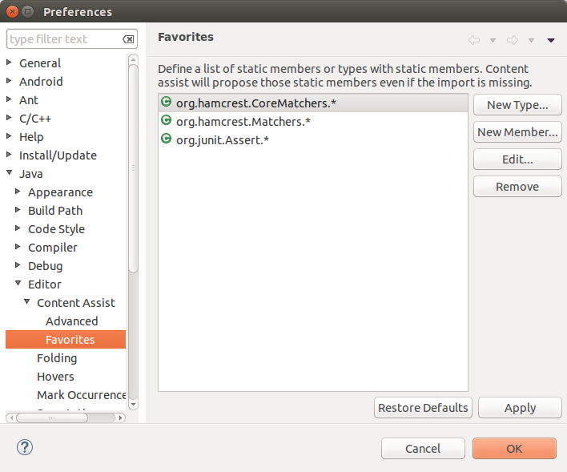

You can now use *Content Assists* (shortcut: *Ctrl*+*Space*) to add the method and the import.


## 10. Exercise: Using JUnit

### 10.1. Project preparation

Create a new project called *com.vogella.junit.first*.

Create a new source folder `test`. For this right-click on your project, select *Properties* and choose *Java* &#8594; *Build Path*. Select the *Source* tab.

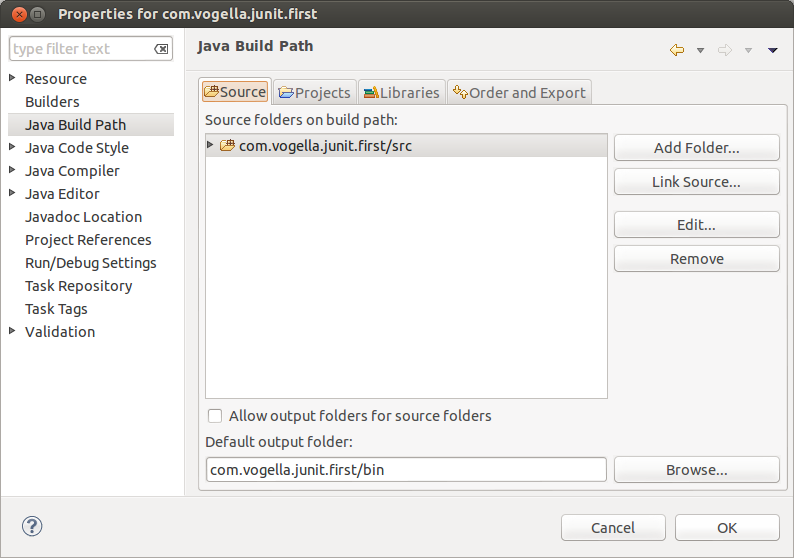

Press the `Add Folder` button. Afterwards, press the `Create New Folder` button. Enter `test` as folder name.

The result is depicted in the following screenshot.

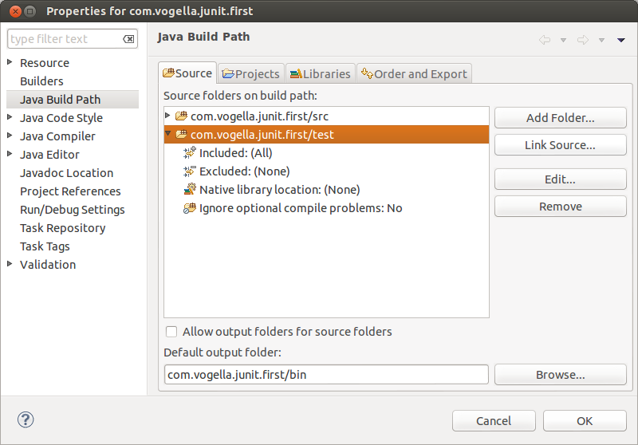

> **Tip:** You can also add a new source folder by right-clicking on a project and selecting *New* &#8594; *Source Folder*.

### 10.2. Create a Java class

In the `src` folder, create the `com.vogella.junit.first` package and the following class.

```java
package com.vogella.junit.first;

public class MyClass {
    public int multiply(int x, int y) {
        // the following is just an example</em>
        if (x > 999) {
            throw new IllegalArgumentException("X should be less than 1000");
        }
        return x / y;
    }
}
```

### 10.3. Create a JUnit test

Right-click on your new class in the *Package Explorer* view and select *New* &#8594; *JUnit Test Case*.

In the following wizard ensure that the *New JUnit 4 test* flag is selected and set the source folder to `test`, so that your test class gets created in this folder.

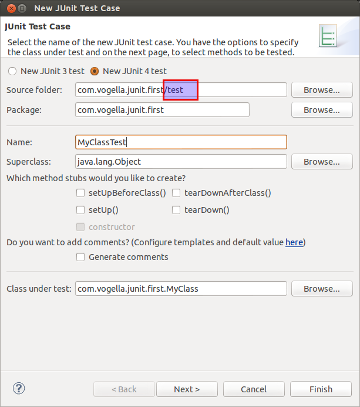

Press the *Next* button and select the methods that you want to test.

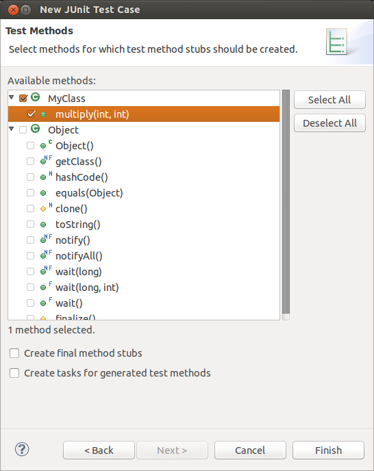

If the JUnit library is not part of the classpath of your project, Eclipse will prompt you to add it. Use this to add JUnit to your project.

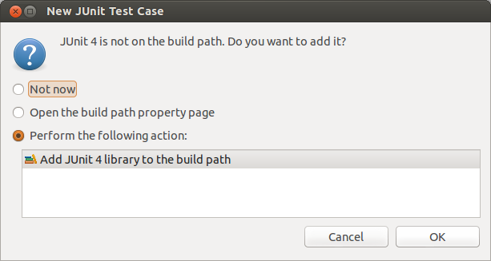

Create a test with the following code.

```java
package com.vogella.junit.first;

import static org.junit.Assert.assertEquals;

import org.junit.AfterClass;
import org.junit.BeforeClass;
import org.junit.Test;

public class MyClassTest {
  
    @Test(expected = IllegalArgumentException.class)
    public void testExceptionIsThrown() {
        MyClass tester = new MyClass();
        tester.multiply(1000, 5);
    }

    @Test
    public void testMultiply() {
        MyClass tester = new MyClass();
        assertEquals("10 x 5 must be 50", 50, tester.multiply(10, 5));
    }
}
```

### 10.4. Run your test in Eclipse

Right-click on your new test class and select *Run-As* &#8594; *JUnit Test*.

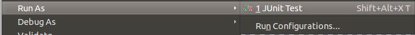

The result of the tests are displayed in the JUnit view. In our example one test should be successful and one test should show an error. This error is indicated by a red bar.

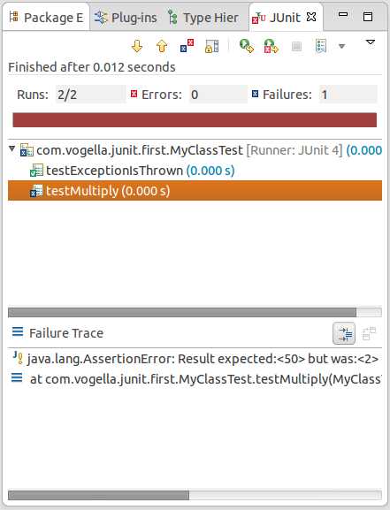

The test is failing, because our multiplier class is currently not working correctly. It does a division instead of multiplication. Fix the bug and re-run the test to get a green bar.


## 11. Advanced JUnit options

### 11.1. Parameterized test

JUnit allows you to use parameters in a tests class. This class can contain one test method and this method is executed with the different parameters provided.

You mark a test class as a parameterized test with the `@RunWith(Parameterized.class)` annotation.

Such a test class must contain a static method annotated with `@Parameters` that generates and returns a collection of arrays. Each item in this collection is used as parameter for the test method.

You can use the `@Parameter` annotation on public fields to get the test values injected in the test.

The following code shows an example for a parameterized test. It tests the `multiply()` method of the `MyClass` class which is included as inner class for the purpose of this example.

```java
package testing;

import org.junit.Test;
import org.junit.runner.RunWith;
import org.junit.runners.Parameterized;
import org.junit.runners.Parameterized.Parameters;

import java.util.Arrays;
import java.util.Collection;

import static org.junit.Assert.assertEquals;
import static org.junit.runners.Parameterized.*;

@RunWith(Parameterized.class)
public class ParameterizedTestFields {

    // fields used together with @Parameter must be public
    @Parameter
    public int m1;
    @Parameter (value = 1)
    public int m2;


    // creates the test data
    @Parameters
    public static Collection<Object[]> data() {
        Object[][] data = new Object[][] { { 1 , 2 }, { 5, 3 }, { 121, 4 } };
        return Arrays.asList(data);
    }


    @Test
    public void testMultiplyException() {
        MyClass tester = new MyClass();
        assertEquals("Result", m1 * m2, tester.multiply(m1, m2));
    }


    // class to be tested
    class MyClass {
        public int multiply(int i, int j) {
            return i *j;
        }
    }

}
```

Alternatively to using the `@Parameter` annotation on public fields you can use a constructor in which you store the values for each test. The number of elements in each array provided by the method annotated with `@Parameters` must correspond to the number of parameters in the constructor of the class. The class is created for each parameter and the test values are passed via the constructor to the class.

```java
package de.vogella.junit.first;

import static org.junit.Assert.assertEquals;

import java.util.Arrays;
import java.util.Collection;

import org.junit.Test;
import org.junit.runner.RunWith;
import org.junit.runners.Parameterized;
import org.junit.runners.Parameterized.Parameters;

@RunWith(Parameterized.class)
public class ParameterizedTestUsingConstructor {

    private int m1;
    private int m2;

    public ParameterizedTestUsingConstructor(int p1, int p2) {
        m1 = p1;
        m2 = p2;
    }

    // creates the test data
    @Parameters
    public static Collection<Object[]> data() {
        Object[][] data = new Object[][] { { 1 , 2 }, { 5, 3 }, { 121, 4 } };
        return Arrays.asList(data);
    }


    @Test
    public void testMultiplyException() {
        MyClass tester = new MyClass();
        assertEquals("Result", m1 * m2, tester.multiply(m1, m2));
    }


    // class to be tested
    class MyClass {
        public int multiply(int i, int j) {
            return i *j;
        }
    }

}
```

If you run this test class, the test method is executed with each defined parameter. In the above example the test method is executed three times.

### 11.2. JUnit Rules

Rules allow very flexible addition or redefinition of the behavior of each test method in a test class. Via the `@Rule` annotation you can create objects which can be used and configured in your test methods. This adds more flexibility to your tests. You could, for example, specify which exception message you expect during execution of your test code.

```java
package de.vogella.junit.first;

import org.junit.Rule;
import org.junit.Test;
import org.junit.rules.ExpectedException;

public class RuleExceptionTesterExample {

    @Rule
    public ExpectedException exception = ExpectedException.none();

    @Test
    public void throwsIllegalArgumentExceptionIfIconIsNull() {
        exception.expect(IllegalArgumentException.class);
        exception.expectMessage("Negative value not allowed");
        ClassToBeTested t = new ClassToBeTested();
        t.methodToBeTest(-1);
    }
}
```

JUnit already provides several useful implementations of rules. For example, the `TemporaryFolder` class allows to setup files and folders which are automatically removed after each test run.

The following code shows an example for the usage of the `TemporaryFolder` implementation.

```java
package de.vogella.junit.first;

import static org.junit.Assert.assertTrue;

import java.io.File;
import java.io.IOException;

import org.junit.Rule;
import org.junit.Test;
import org.junit.rules.TemporaryFolder;

public class RuleTester {

    @Rule
    public TemporaryFolder folder = new TemporaryFolder();

    @Test
    public void testUsingTempFolder() throws IOException {
        File createdFolder = folder.newFolder("newfolder");
        File createdFile = folder.newFile("myfilefile.txt");
        assertTrue(createdFile.exists());
    }
}
```

For more examples of existing rules see [JUnit Rules wiki](https://github.com/junit-team/junit/wiki/Rules).

### 11.3. Writing custom JUnit Rules

To write your custom rule, you need to implement the `TestRule` interface. This interface defines the `apply(Statement, Description)` method which must return an instance of `Statement`. Statement represent the tests within the JUnit runtime and Statement#evaluate() run these. Description describes the individual test. It allows to read information about the test via reflection.

The following is a simple example for adding a log statement to an Android application before and after test execution.

```java
package testing.android.vogella.com.asynctask;


import android.util.Log;

import org.junit.rules.TestRule;
import org.junit.runner.Description;
import org.junit.runners.model.Statement;

public class MyCustomRule implements TestRule {
    private Statement base;
    private Description description;

    @Override
    public Statement apply(Statement base, Description description) {
        this.base = base;
        this.description = description;
        return new MyStatement(base);
    }

    public class MyStatement extends Statement {
        private final Statement base;

        public MyStatement(Statement base) {
            this.base = base;
        }

        @Override
        public void evaluate() throws Throwable {
            Log.w("MyCustomRule",description.getMethodName() + "Started");
            try {
                base.evaluate();
            } finally {
                Log.w("MyCustomRule",description.getMethodName() + "Finished");
            }
        }
    }
}
```

To use this rule, simple add field annotated with `@Rule` to your test class.

```java
@Rule
public MyCustomRule myRule = new MyCustomRule();
```

### 11.4. Categories

It is possible to define categories of tests and include or exclude them based on annotations. The following example is based on the [JUnit 4.8 release notes](https://github.com/junit-team/junit/blob/master/doc/ReleaseNotes4.8.md).

```java
public interface FastTests { /* category marker */
}

public interface SlowTests { /* category marker */
}

public class A {
    @Test
    public void a() {
        fail();
    }

    @Category(SlowTests.class)
    @Test
    public void b() {
    }
}

@Category({ SlowTests.class, FastTests.class })
public class B {
    @Test
    public void c() {
    }
}

@RunWith(Categories.class)
@IncludeCategory(SlowTests.class)
@SuiteClasses({ A.class, B.class })
// Note that Categories is a kind of Suite
public class SlowTestSuite {
    // Will run A.b and B.c, but not A.a
}

@RunWith(Categories.class)
@IncludeCategory(SlowTests.class)
@ExcludeCategory(FastTests.class)
@SuiteClasses({ A.class, B.class })
// Note that Categories is a kind of Suite
public class SlowTestSuite {
    // Will run A.b, but not A.a or B.c
}
```


## 12. Mocking

Unit testing also makes use of object mocking. In this case the real object is exchanged by a replacement which has a predefined behavior for the test.

There are several frameworks available for mocking. To learn more about mock frameworks please see the [Mockito tutorial](http://www.vogella.com/tutorials/Mockito/article.html) and the [EasyMock tutorial](http://www.vogella.com/tutorials/EasyMock/article.html)


## 13. Links and Literature

### 13.1. Source Code

[Source Code of Examples](http://www.vogella.com/code/index.html)

### 13.2. JUnit Resources

[Eclipse IDE book from Lars Vogel](http://www.amazon.com/dp/3943747042)

[JUnit Homepage](http://www.junit.org/)