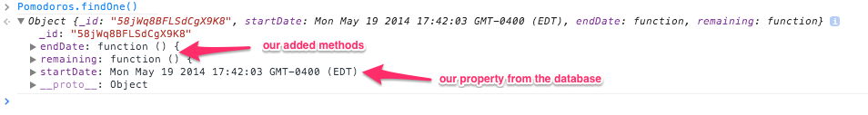
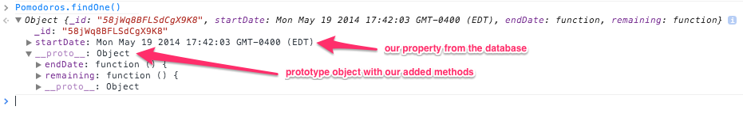

# Adding computed properties to Meteor data

Meteor has a very light-weight model layer compared to web frameworks like Rails. In fact, depending on your definition of what a model layer is, it might not have one at all. It stays very close to MongoDB, providing plain JavaScript object representations of your MongoDB documents.

Often you'll want your Collection objects to have some behavior or computed properties. In our [Meteor workshop](http://www.okgrow.com/meteor/learn/) we build a team-based [Pomodoro](http://en.wikipedia.org/wiki/Pomodoro_Technique) timer app as an exercise, so we need a `Pomodoros` collection. We need to know how many minutes and seconds are left in a given Pomodoro, and whether it's finished or not, but we don't want to continually update attributes in the database like `completed` or `timeRemaining`. Those can be computed easily based on the start time.

So we just store a `startDate` attribute which is a `Date` object (which represents a date and time down to the millisecond).

We could have helpers that calculate time remaining and use a [Spacebars](https://github.com/meteor/meteor/blob/master/packages/spacebars/README.md) tag like `{{timeRemaining this}}`. But object-oriented programming was invented for a reason - sometimes it's nice to actually have methods on your objects.

# Change your Collection objects using “transform”

Meteor's [`Collection` constructor](http://docs.meteor.com/#meteor_collection) can take an option called `transform`. You can specify a function that modifies the objects which are returned:

> <strong>transform</strong> Function
>
> An optional transformation function. Documents will be passed through this function before being returned from fetch or findOne, and before being passed to callbacks of observe, map, forEach, allow, and deny. Transforms are not applied for the callbacks of observeChanges or to cursors returned from publish functions.

Let's add `endDate()` and `remaining()` functions that return values calculated from the `startDate` attribute. Here's the simplest way:

```javascript
1   Pomodoros = new Meteor.Collection("Pomodoros", {
2       transform: function (doc) {
3           doc.endDate = function () {
4               // SugarJS gives us minutesAfter() which gives us a nice syntax for
5               // creating new Date objects
6               // http://sugarjs.com/api/Number/unitAfter
7               return ((25).minutesAfter(this.startDate));
8           };
9           doc.remaining = function () {
10              return this.endDate().getTime() - Date.now();
11          };
12          return doc;
13      }
14  });
```



# Give your Collection objects shared methods using a prototype

JavaScript's method of sharing code between objects is to use an object prototype. (If you're used to class-based OO languages like Java, Ruby or Python and aren't sure how JS is different then read about the difference [here](https://developer.mozilla.org/en-US/docs/Web/JavaScript/Guide/Inheritance_and_the_prototype_chain)).

So rather than defining a new function on every object, let's give our Pomodoro objects a prototype with our `endDate()` and `remaining()` functions:

```javascript
1   // create an object with the desired methods to use as prototype
2   var pomodoro  = {
3       endDate : function () {
4           // SugarJS gives us minutesAfter() which gives us a nice syntax for
5           // creating new Date objects
6           // http://sugarjs.com/api/Number/unitAfter
7           return ((25).minutesAfter(this.startDate));
8       },
9       remaining: function () {
10          return this.endDate().getTime() - Date.now();
11      }
12  };
13
14  Pomodoros = new Meteor.Collection("Pomodoros", {
15      transform: function (doc) {
16          // create a new empty object with pomodoro as it's prototype
17          var newInstance = Object.create(pomodoro);
18
19          // copy the data from doc to newInstance and return newInstance
20          return _.extend(newInstance, doc);
21      }
22  });
```

Here we define an object to use as the prototype (lines 1-12). It has two functions, `endDate()` and `remaining()`.

Our transform function creates a new empty object using our object as the prototype (using [Object.create()](https://developer.mozilla.org/en-US/docs/Web/JavaScript/Reference/Global_Objects/Object/create)).

It then copies the data fields from `doc` to it (`doc` is our object that was retrieved from the Collection).

So we return a new object with our custom prototype that has the data fields from object that was retrieved from our Collection added to it.



Whichever technique we use, the result is that all objects returned by queries on our Collections end up with our custom methods added to them to provide computed properties.
